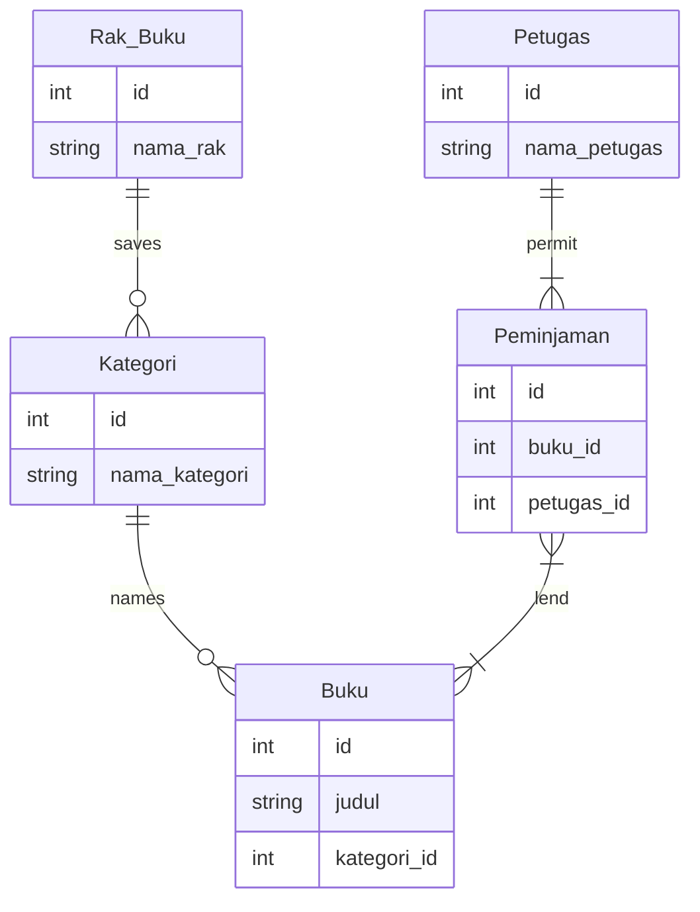

# Database Perpustakaan

```mermaid
erDiagram
Buku{
    int id 
    string judul
    int kategori_id
}

Kategori{
    int id
    string nama_kategori
}

Kategori || --o{ Buku : names

Rak_Buku{
    int id
    string nama_rak
}

Rak_Buku || --o{ Kategori : saves

Petugas{
    int id
    string nama_petugas
}

Peminjaman{
    int id
    int buku_id
    int petugas_id
}

Peminjaman }| --|{ Buku : lend
Petugas || --|{ Peminjaman : permit
```
